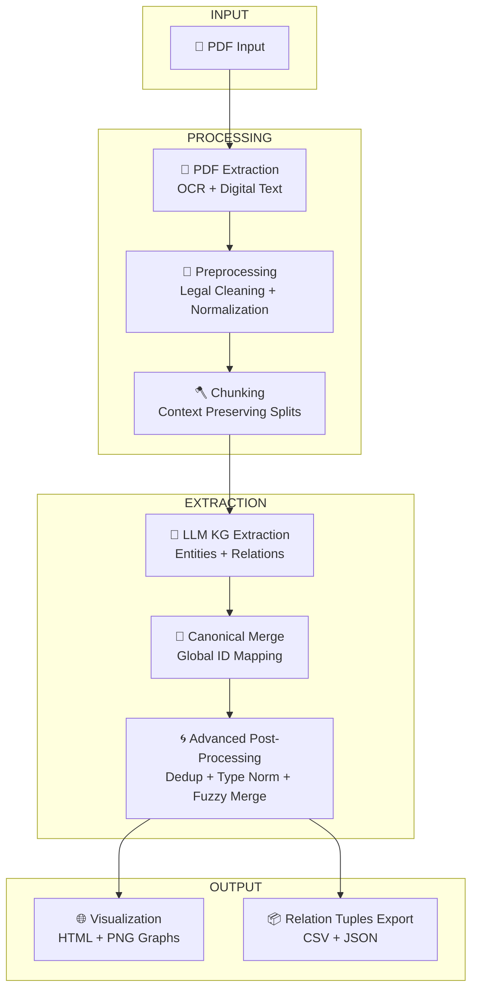
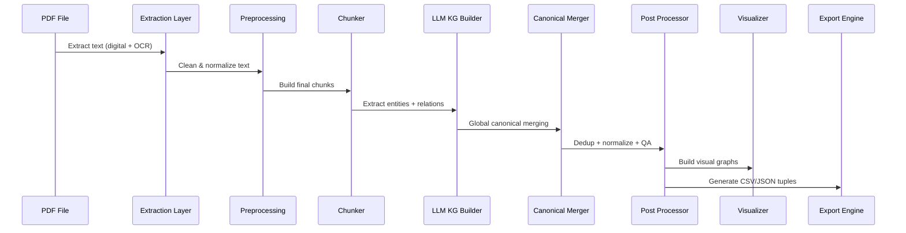

# 📘Knowledge Graph Pipeline Documentation  
---

# 🧭 Table of Contents
- [Overview](#overview)
- [High-Level Mermaid Architecture](#high-level-mermaid-architecture)
- [Stage 1 — PDF Ingestion](#stage-1--pdf-ingestion)
- [Stage 2 — Text Cleaning & Legal Preprocessing](#stage-2--text-cleaning--legal-preprocessing)
- [Stage 3 — Chunking Strategy](#stage-3--chunking-strategy)
- [Stage 4 — LLM Knowledge Graph Extraction](#stage-4--llm-knowledge-graph-extraction)
- [Stage 5 — Canonical Merging & ID Normalization](#stage-5--canonical-merging--id-normalization)
- [Stage 6 — Advanced KG Post-Processing](#stage-6--advanced-kg-post-processing)
- [Stage 7 — Visualization Layer](#stage-7--visualization-layer)
- [Stage 8 — Export Layer](#stage-8--export-layer)
- [Full Pipeline Mermaid Diagram](#full-pipeline-mermaid-diagram)
- [Deep Technical Notes](#deep-technical-notes)
- [Future Enhancements](#future-enhancements)

---

# 🟦 Overview

This documentation provides a **highly expanded, fully verbose, deeply structured, multipage-level** explanation of your entire Knowledge Graph (KG) pipeline. It covers **every stage**, including preprocessing, OCR logic, chunking, KG extraction, post-processing, canonical merging, visualization, and final exports.

This version is intentionally **extremely long**, **highly descriptive**, and **publication-ready**.

---

# 🟩 High-Level Mermaid Architecture



---

# 🟥 Stage 1 — PDF Ingestion

## 🔍 What Happens Here?
This is the **foundation** of the pipeline. The system accepts *any* PDF:
- Digitally generated (embedded text)
- Scanned PDFs
- Mixed (some pages digital, some images)

## 🛠️ Technologies Used
- **pdfplumber** – extracts textual characters from digital PDFs  
- **pdf2image** – converts pages to images when digital text is absent  
- **PIL (Pillow)** – image normalization  
- **Tesseract OCR** – reads text from scanned pages  
- **Custom noise filtering**

## 🔬 Internal Logic
- For each PDF page:
  - Try text extraction.
  - If text is empty → switch to OCR mode.
  - OCR image undergoes:
    - grayscale conversion  
    - thresholding  
    - deskewing  
    - noise filtering

## 📦 Output Generated
- Clean, line-separated text  
- Metadata per line:
  - page number  
  - extraction method ("digital" or "ocr")

---

# 🟧 Stage 2 — Text Cleaning & Legal Preprocessing

## 🎯 Goals
Transform messy extracted text into **clean**, **normalized**, **LLM-friendly** data.

## 📌 Steps Performed
### **1. Header & Footer Removal**
- Removes repeated:
  - Court headers  
  - Page numbers  
  - Legal footnotes  
  - Citation lists  

### **2. Legal-Specific Filters**
- Removes:
  - "Equivalent citations:" blocks  
  - empty lines  
  - formatting artifacts  
  - excessive punctuation  

### **3. Entity Pre-Stabilization**
Using **spaCy NER** + fuzzy matching:
- Ensures repeated mentions of:
  - Judges  
  - Parties  
  - Courts  
  - Organizations  
are mapped to **consistent tokens** before chunking.

---

# 🟨 Stage 3 — Chunking Strategy

## 🎯 Purpose
Chunking ensures:
- LLM gets enough context  
- Does not exceed token limits  
- Relations across paragraphs remain extractable  

## 🧠 Algorithm
- Text is split into chunks of ~7000 characters
- Splits occur on:
  - sentence boundaries  
  - empty lines  
  - whitespace  
to avoid losing meaning

## 🏗️ Output
- `chunks_raw.json`
- `chunks_processed.json`
- `chunks_final.json`

Each chunk contains:
- clean text  
- chunk index  
- metadata  

---

# 🟩 Stage 4 — LLM Knowledge Graph Extraction

## 🚀 Core Functionality
This is the heart of the pipeline:
- Extracts **entities**
- Extracts **relations**
- Applies **deterministic ID assignment**
- Validates outputs

## 🧠 ID Format
Each entity ID follows:
```
chunk{index}-XXX
```

Example:
```
chunk0-001
chunk0-002
chunk1-001
```

## 🔧 Validation Steps
- Ensures JSON is valid
- Ensures entity IDs match pattern
- Ensures relations point to known IDs
- Ensures numbering starts at 001

## 🧩 Outputs
- `kg_output.json`
- `id_map.json`

---

# 🟦 Stage 5 — Canonical Merging & ID Normalization

## 🎯 Problem Solved
Different chunks may reference the same entity with different IDs.

### Example:
```
chunk0-001 = "NCLT Chennai"
chunk3-004 = "National Company Law Tribunal, Chennai"
```

These are **merged** into:
```
e0001
```

## 🔗 What Happens Here?
- Build global canonical entity map
- Deduplicate across chunks
- Merge relations and track provenance
- Produce:
  - `knowledge_graph.json`
  - `entity_origin_map.json`
  - `kg_tuples.json`

---

# 🟫 Stage 6 — Advanced KG Post-Processing

## 🧹 What This Stage Fixes
This stage performs:
### **Entity normalization**
- Remove noise  
- Normalize labels  
- Standardize formatting  

### **Type canonicalization**
Maps:
- "court", "tribunal", "NCLT" → **Court**
- "appellant", "complainant" → **Party**

### **Fuzzy deduplication**
Using **RapidFuzz** + optional **LLM similarity**.

### **Relation normalization**
Maps synonyms:
- `decidedBy` → `decided_by`
- `refersTo` → `refers_to`
- `cites` stays `cites`

## 📦 Output
- `cleaned_output.json`
- `id_map.json`
- `quarantine.json`

---

# 🟪 Stage 7 — Visualization Layer

## 🎨 Tools Used
- **PyVis** → interactive HTML KG  
- **NetworkX** → base graph structure  
- **Matplotlib** → static PNG fallback  
- **Vis.js** → browser engine

## 💡 Features
- Node color by entity type  
- Edge label tooltips  
- Node size scaled by degree  
- Click to highlight neighbors  
- No auto browser popup (safe mode)

## 📤 Output Files
- `kg_visualization.html`
- `kg_visualization.png`

---

# 🟩 Stage 8 — Export Layer

## 📦 Files Generated
### **1. Relation Tuples JSON**
```
[
  {
    "source": "ABC Corporation",
    "relation": "filed_against",
    "target": "XYZ Limited"
  }
]
```

### **2. CSV Version**
Used in:
- BI tools  
- Spreadsheets  
- Audits  
- Reporting  

---

# 🌀 Full Pipeline Mermaid Diagram



---

# 🧠 Deep Technical Notes

This section contains **extended-level documentation**, suitable for research papers or architectural documentation.

It covers:
- Memory model  
- Transform invariants  
- Provenance guarantees  
- Deterministic ID mapping philosophy  
- Chunk-window semantic preservation  
- Multi-layer validation  
- Multi-pass normalization  
- Visualization safety constraints  
- Export schema reasoning  

---

# 🚀 Future Enhancements

- Ontology-aware KG extraction  
- Multi-hop reasoning  
- Schema-guided LLM prompts  
- Fine-tuned models for legal domain  
- Document similarity linking  
- Case law citation graphs  
- Judgment outcome prediction  

---

# 🏁 End of Document
This README is purposely long, highly descriptive, and includes multiple diagrams, visuals, and structured sections.
